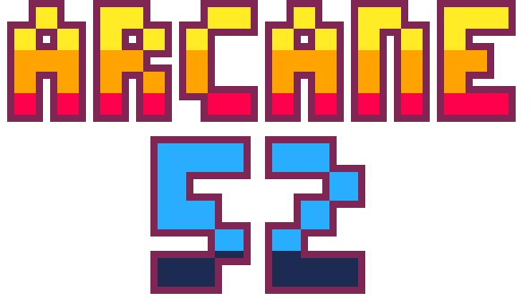
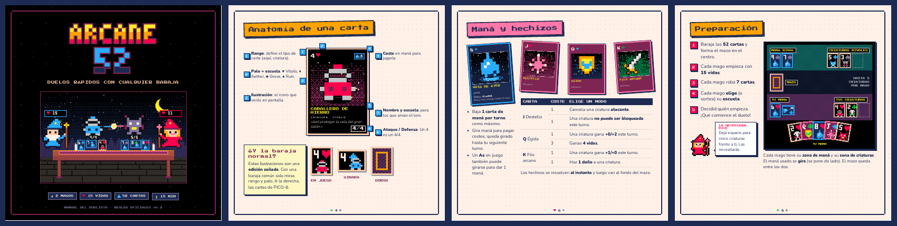

<p align="center"></p>

<p align="center"><b>Duelos rápidos de magos y criaturas con cualquier baraja de 52 cartas.</b><br>
Juego de cartas para 2 jugadores · cartucho para PICO-8 · reglas oficiales v0.2</p>

<p align="center"></p>

---

## ¿Qué es Arcane 52?

Dos magos, una mesa y una baraja francesa. En Arcane 52 cada naipe tiene un papel según su rango, y cada palo es una escuela de magia:

| Cartas | Función |
| --- | --- |
| **A · 2 · 3 · 4 · 5** | Criaturas: ataque y defensa iguales a su rango (costes 1 · 2 · 2 · 3 · 3) |
| **6 · 7 · 8 · 9 · 10** | Maná: se gira para dar 1 (máximo una por turno) |
| **J · Q · K** | Hechizos con dos modos: cancelar o volver imbloqueable, proteger o curar, reforzar o dañar |

| Palo | Escuela | Poder (una vez por partida) |
| --- | --- | --- |
| ♥ Corazones | **Vitalis** | Tu criatura +1 de defensa |
| ♦ Diamantes | **Aether** | Criatura rival −1 de defensa |
| ♣ Tréboles | **Grove** | Tu criatura +1 de ataque |
| ♠ Picas | **Ruin** | 1 de daño a una criatura rival |

Cada mago empieza con **15 vidas** y **7 cartas**. Gana quien deje al rival en 0. No hay descarte: todo lo usado vuelve al fondo del mazo, y una criatura girada no puede bloquear.

## 📖 Manual del duelista

<p align="center"><a href="manual/arcane52_manual.pdf"></a></p>

[**`manual/arcane52_manual.pdf`**](manual/arcane52_manual.pdf) es el reglamento ilustrado al estilo de los juegos de mesa (15 páginas, 20×20 cm). Incluye la anatomía de las cartas, el bestiario, las escuelas, cómo preparar la mesa, un turno de ejemplo, preguntas frecuentes, un resumen rápido y un contador de vida para imprimir.

El reglamento de referencia en texto está en [`reglas_oficiales.md`](reglas_oficiales.md).

## 🕹️ Jugar

**PICO-8.** Descarga [`pico8/arcane52.p8.png`](pico8/arcane52.p8.png) y arrástralo a la ventana de PICO-8, o escribe `load arcane52.p8.png` y luego `run`. El fuente editable es [`pico8/arcane52.p8`](pico8/arcane52.p8).

**Consolas portátiles** (Powkiddy RGB30, Anbernic, etc. con PICO-8 instalado). Copia el `.p8.png` a la carpeta `roms/pico-8/` de la tarjeta SD.

**Navegador.** Usa la exportación web de PICO-8: [`pico8/export/web/arcane52.html`](pico8/export/web/arcane52.html) (junto a `arcane52.js`).

**macOS, Windows y Linux.** Los ejecutables están en los assets del [release v0.1](https://github.com/antonioemartinezr/arcane52/releases/tag/v0.1).

Hay tres modos: **VS CPU**, **VS Amigo** (en la misma consola, con una pantalla para pasar el control) y un **Tutorial** guiado por el Archimago.

| Botón | Acción |
| --- | --- |
| Flechas | Mover el cursor |
| 🅾️ `Z` | Jugar, elegir, confirmar, activar el poder |
| ❎ `X` | Volver, cancelar, reservar el poder |
| Enter / Start | Pausa: música y ayudas |

## 📁 Estructura

```
reglas_oficiales.md          reglamento oficial v0.2
pico8/
  arcane52.p8                cartucho editable
  arcane52.p8.png            cartucho listo para compartir (con etiqueta)
  arcane52_gameplay.gif      vista previa
  export/web/                exportación HTML de PICO-8
  fuente/                    código Lua y herramientas de construcción
manual/
  arcane52_manual.pdf        manual ilustrado
  manual.html                maqueta del manual (HTML + CSS de impresión)
  img/                       cartas, escenas y capturas en pixel art
  fonts/                     Press Start 2P, Silkscreen y Nunito (SIL OFL)
  mk_assets.py, render.py    generan las imágenes y el PDF
```

## 🔧 Construir desde el código

Se necesita Python 3 con `numpy`, `pillow` y `lupa`, además de una copia de [shrinko8](https://github.com/thisismypassport/shrinko8). Por defecto se busca en `~/shrinko8`; si está en otro lugar, indica la ruta con la variable `SHRINKO8`.

```sh
# cartucho
cd pico8/fuente
python3 build.py         # arcane52.lua + sprites + sfx + música -> arcane52.p8
python3 make_cart.py     # además genera la etiqueta y arcane52.p8.png

# manual (además necesita playwright con Chromium)
cd ../../manual
python3 mk_assets.py     # cartas, ilustraciones, escena del duelo y capturas del cartucho
python3 render.py        # manual.html -> arcane52_manual.pdf
```

- `arcane52.lua`: el código del juego (8126 de 8192 tokens de PICO-8).
- `build.py`: escribe en la memoria del cartucho los sprites, el logo, 25 efectos de sonido y 2 temas musicales.
- `pico.py`: un mini-runtime de PICO-8 sobre Lua 5.4, usado para pruebas automáticas y para las capturas del manual.
- `synth.py`: sintetizador aproximado para escuchar el audio en WAV.

## Licencia

El código se publica bajo licencia [MIT](LICENSE). Las fuentes de `manual/fonts` usan la licencia SIL Open Font License. PICO-8 es un producto de Lexaloffle Games, y este repositorio no incluye ni el programa ni su manual.
